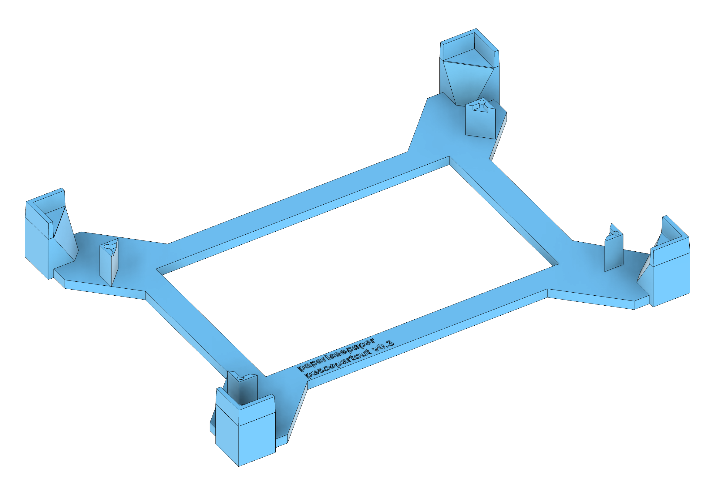
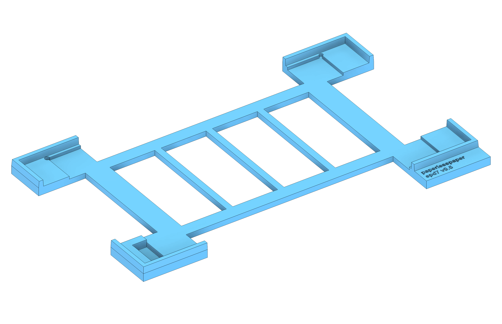

### Hardware

Here you will find all source files of our PCB design and hardware CAD files used for the [paperlesspaper](https://paperlesspaper.de/en) ePaper photo frame.

You need Fusion 360 to open and edit these files.

### What you need

Software:

- Autodesk Fusion 360

Manufacture:

- 3D printer (for battery holder and for fixtures/carriers)
- laser cutter (or CNC) for back panel of the photo frame

Hardware (suggested):

- Standard picture-frame with turn buttons or spring clips

### Source files

#### paper7-inside.f3z

The inner carrier (sub-frame) that the PCB attaches to. Contains the PCB and 3D printed parts for USB connector, battery holder and distance elements.

#### paper7-picture-frame.f3z

The picture frame. Used to create the laser cut on the backside. Fits the "inside".

#### paper7-passepartout-appliance-fixture.f3z

A slimmer jig for aligning the display with a passe-partout / mat.
Ensures the visible window is perfectly centered and parallel.

#### paper7-display-appliance-fixture.f3z

A jig to hold the display/appliance while you bond it. Keeps the panel centered relative to the frame opening.
