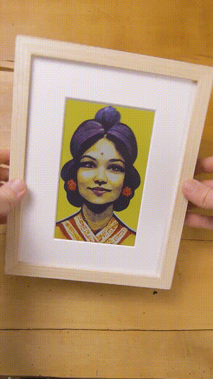
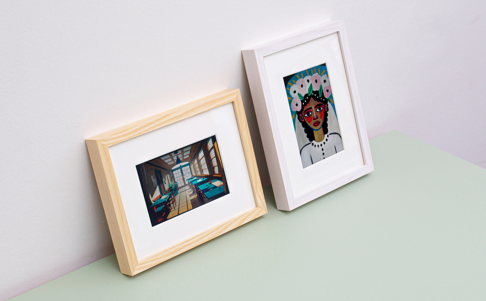
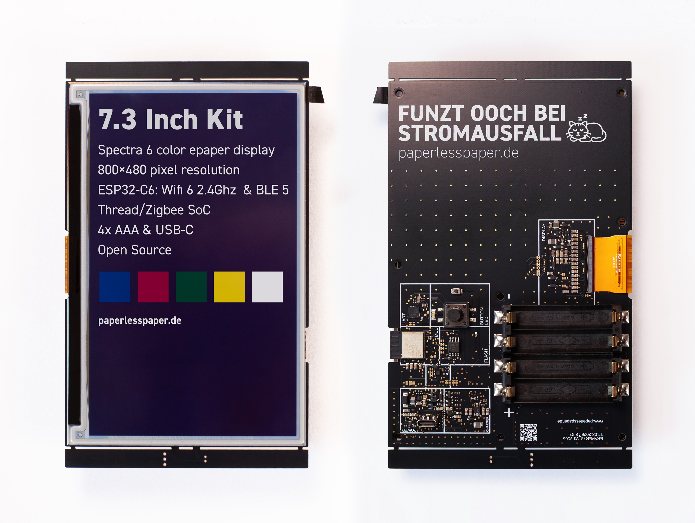
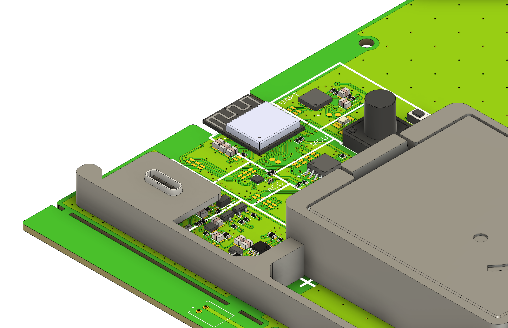
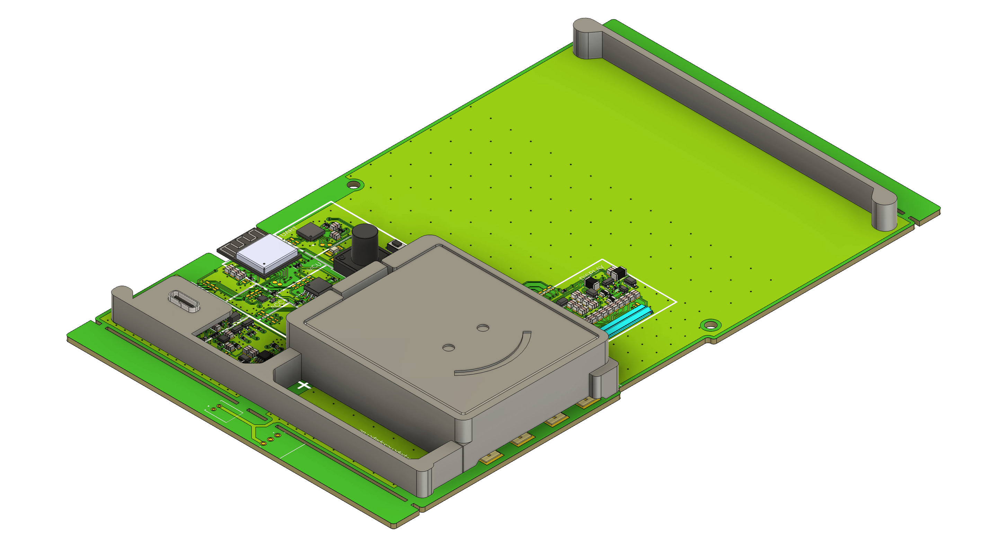
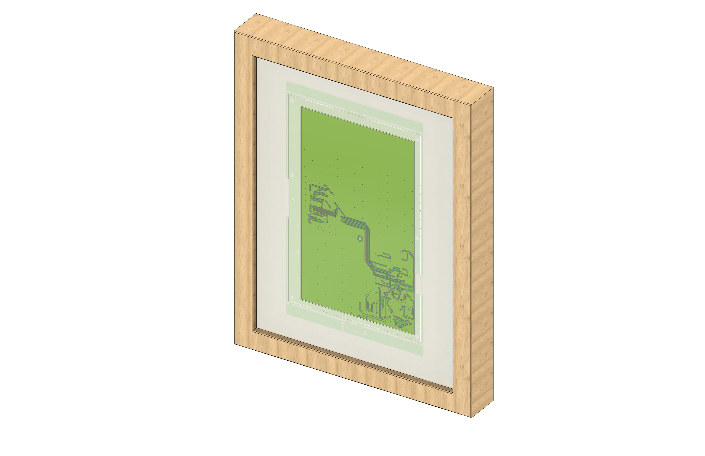
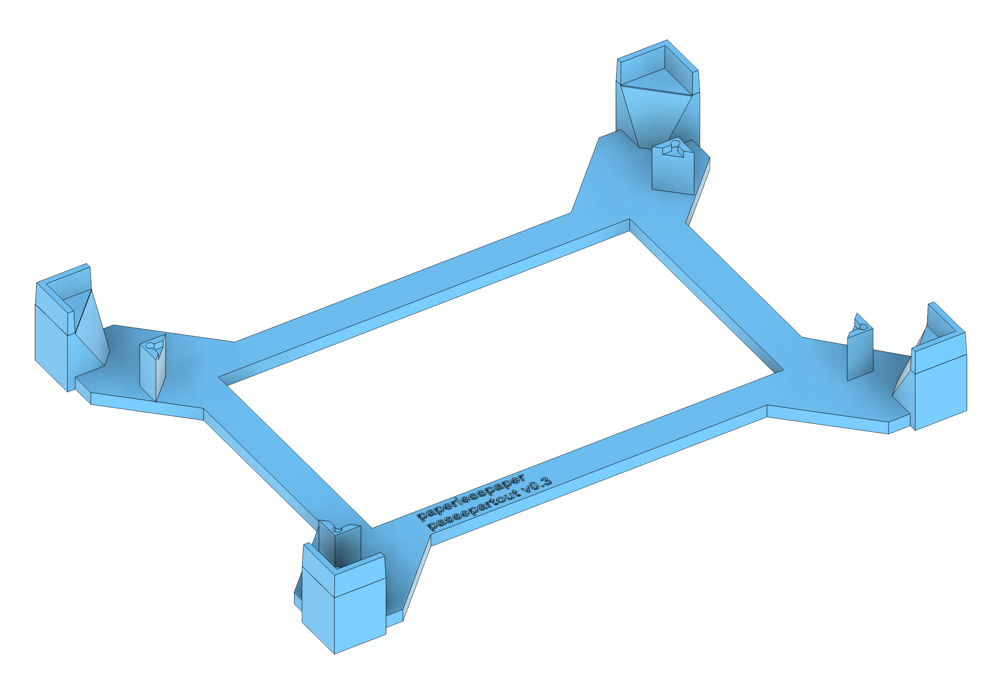
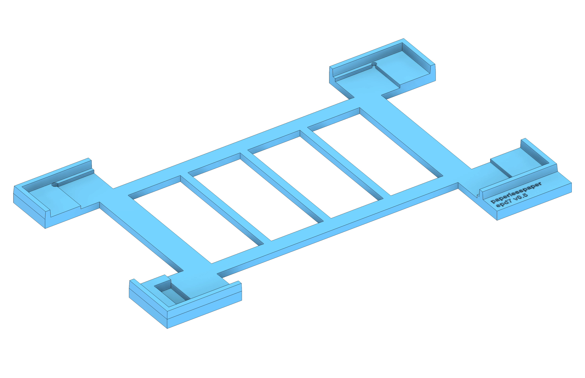

### [paperlesspaper](https://paperlesspaper.de/en) e-Paper Photo Frame Hardware

Here you will find all source files of our PCB design and hardware CAD files used for the [paperlesspaper](https://paperlesspaper.de/en) ePaper photo frame which has a Spectra 6 color EInk display.

There is also a short [blog post](https://paperlesspaper.de/en/blog/open-hardware) available.

### What you need

Software:

- Autodesk Fusion 360
- Adobe Illustrator

Manufacture:

- 3D printer (for battery holder and for fixtures/carriers)
- laser cutter (or CNC) for back panel of the photo frame
- manufacturer like JLCPCB for the PCB (more info soon)

Hardware:

- Standard picture-frame with turn buttons or spring clips

### Source files

All files can be found inside [/paper7](./paper7/).

#### [paper7-inside.f3z](./paper7/paper7-inside.f3z)

The inner carrier (sub-frame) that the PCB attaches to. Contains the PCB and 3D printed parts for USB connector, battery holder and distance elements.

#### [paper7-picture-frame.f3z](./paper7/paper7-picture-frame.f3z)

The picture frame. Used to create the laser cut on the backside. Fits the "inside".

#### [paper7-passepartout-appliance-fixture.f3z](./paper7/paper7-passepartout-appliance-fixture.f3z)

A slimmer jig for aligning the display with a passe-partout / mat.
Ensures the visible window is perfectly centered and parallel.

#### [paper7-display-appliance-fixture.f3z](./paper7/paper7-display-appliance-fixture.f3z)

A jig to hold the display/appliance while you bond it. Keeps the panel centered relative to the frame opening.

#### [lasercut/Lasercut-back-generic.ai](./lasercut/Lasercut-back-generic.ai) and [.svg](./lasercut/Lasercut-back-generic.svg)

The lasercut source files to create the backside of the picture frame.

Color mapping: `red: cut`, `black: mark`, `green: ignore`

#### 3D print (battery compartment & spacers)

For the 3D printed files you can find the replacement parts also at [Makerworld](https://makerworld.com/de/models/1668788-paper-7-battery-compartment#profileId-1766474).
The recommended material is PETG. There are no screws needed. Only the battery cover needs to be glued for better durability. Use regular superglue to glue it.
