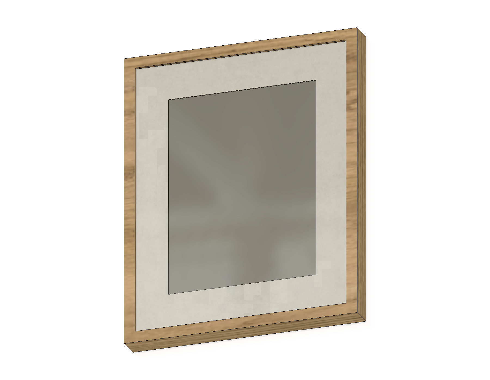
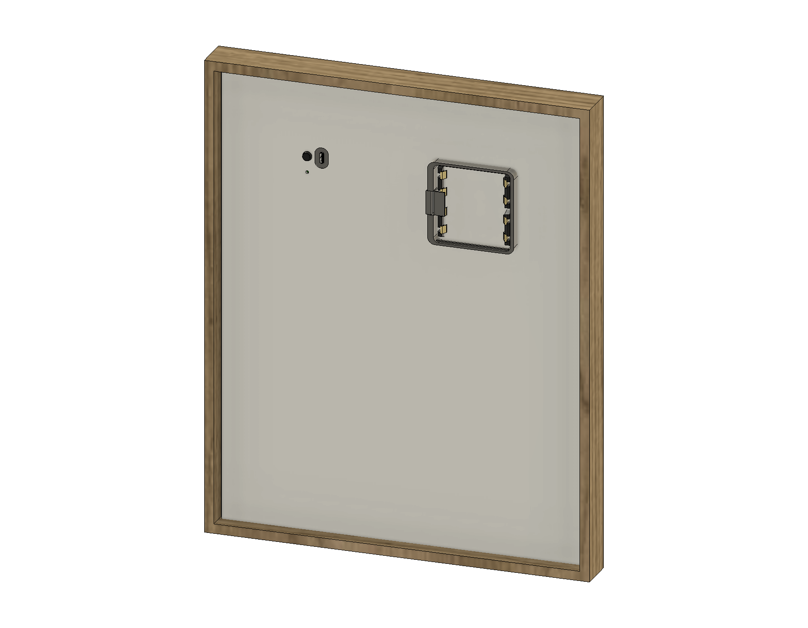
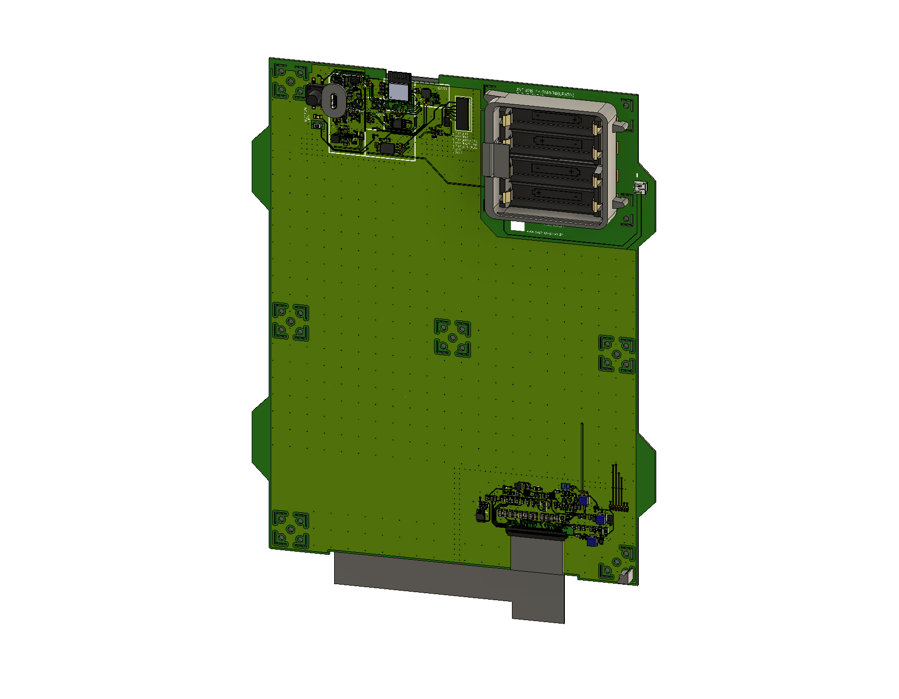
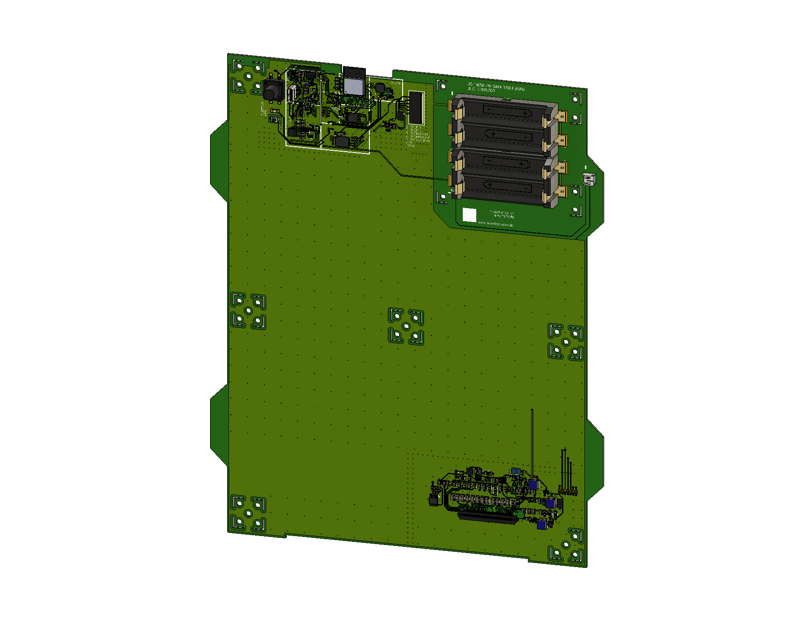

# OpenPaper L hardware

Hardware files for the 13.3-inch OpenPaper L e-Paper photo frame. This directory follows the [Paper 7 hardware](../paper7/) structure, with Fusion CAD, printable replacement parts, PCB sources and back-panel laser templates.

## Fusion CAD

| Front | Back (battery cover hidden) |
| --- | --- |
|  |  |

The frame, inner-assembly and 3D-PCB images are direct **1800 × 1400 px Fusion exports**, using shaded surfaces with visible edge outlines. Sketches, construction points, axes, planes, joint origins and joint markers are hidden. Click an image to open the full resolution.

- [paper-l-picture-frame.f3z](./paper-l-picture-frame.f3z): complete **OpenPaper L Bilderrahmen** assembly, including the wooden frame, glass, passe-partout, back panel, internal carrier, PCB and display references.

Upload the `.f3z` archive through Fusion's data panel to import its linked designs together. The inner assembly is named **OpenPaper L inside 3**. It contains the battery compartment, cover, corner spacer, spring and USB holder. The display reference retains its original Fusion name, **DEK 13.3 inch panel**.

The archive was exported on **2026-09-14** after updating and saving the linked Fusion references:

| Fusion design | Version in the archive |
| --- | --- |
| OpenPaper L Bilderrahmen | 11 |
| OpenPaper L inside 3 | 10 |
| EPAPER133_V2 (3D PCB) | 8 |
| DEK 13.3 inch panel | 4 |

Fusion reports two unresolved rigid-group features named `Starre Gruppe 1` in the picture-frame timeline (positions 21 and 23). These concern missing/invalid rigid-group operands; the linked files are included in the archive. Review these constraints before changing the assembly. The exported print bodies are solid, and their STL dimensions and volumes have been checked against the CAD bodies. Physical print and assembly fit have not been re-tested for this export.

## 3D print

The [stl/](./stl/) files were exported from the above picture-frame assembly in **millimetres**, using binary STL and Fusion's high mesh refinement. Each file contains one part, without the hidden battery-compartment context body.

| File | Fusion component | Bounding box in mm (X × Y × Z) |
| --- | --- | --- |
| [Battery compartment](./stl/paper-l-BatteryCompartment.stl) | Batteriefach v2 | 82.196 × 71.700 × 19.500 |
| [Battery cover](./stl/paper-l-BatteryCover.stl) | Deckel | 65.284 × 64.699 × 3.200 |
| [Corner spacer](./stl/paper-l-Corner.stl) | Corner | 6.605 × 6.605 × 10.000 |
| [Spring](./stl/paper-l-Spring.stl) | Spring | 15.500 × 19.800 × 9.500 |
| [USB holder](./stl/paper-l-USBHolder.stl) | USB holder | 14.300 × 20.080 × 6.500 |

Choose orientation, material and the required number of copies in your slicer for the assembly being built. The dimensions above describe the CAD coordinate orientation, not a recommended print orientation.

## PCB

- [EPAPER133_V2.fsch](./pcb/EPAPER133_V2.fsch): native Fusion Electronics schematic, version 5.
- [EPAPER133_V2.fbrd](./pcb/EPAPER133_V2.fbrd): native Fusion Electronics board, version 13, matching the 2D-board reference recorded in the exported 3D PCB.
- [EPAPER133_V2.3mf](./pcb/EPAPER133_V2.3mf): 3D PCB mesh exported from the updated picture-frame assembly (PCB version 8).
- [Schematic preview](../images/paperl/fsch.png) and [board preview](../images/paperl/fbrd.png): embedded previews from the respective native source files.
- [manufacturing-2026-08-17/](./pcb/manufacturing-2026-08-17/): the existing fabrication batch, containing [Gerber/drill files](./pcb/manufacturing-2026-08-17/paper-l-v2-gerber.zip), [BOM](./pcb/manufacturing-2026-08-17/EPAPER133_V2.csv) and [front-side pick-and-place data](./pcb/manufacturing-2026-08-17/PnP_EPAPER133_V2_front.csv).

**The August fabrication batch predates board version 13.** In particular, the newer source changes the FB2 ferrite footprint and adjacent copper; placements of IC3, J2, J3 and J5 also differ from the archived pick-and-place file. Regenerate fabrication outputs from the native board when manufacturing the current source revision. Do not treat the archived Gerbers as an export of version 13.

The BOM CSV uses the source export's Windows-1252 encoding and comma separator. The pick-and-place CSV has no header; its columns are `reference, x (mm), y (mm), rotation (degrees), value, package`, all on the front side. Keep these two assembly files with the Gerber batch of the same date. The Gerber ZIP contains copper, soldermask, silkscreen, solderpaste, profile, drill and Gerber job files. Unrelated legacy ODB data named `epaper73_v1_v105` from the original ZIP was excluded.

## Laser-cut back panel

The [lasercut/](./lasercut/) directory contains the existing production templates, with separate machine layouts:

| Layout | Illustrator source | SVG | SVG canvas |
| --- | --- | --- | --- |
| Zing | [AI](./lasercut/zing/Lasercut-back-zing.ai) | [SVG](./lasercut/zing/Lasercut-back-zing.svg) | 610 × 400.54 mm |
| Lasersaur | [AI](./lasercut/lasersaur/Lasercut-back-lasersaur.ai) | [SVG](./lasercut/lasersaur/Lasercut-back-lasersaur.svg) | 1100 × 570 mm |

Color mapping: **red = cut**, **black = mark**, **green = ignore / alignment**. These layouts position cutouts and markings on existing frame backs; the canvas size is the machine layout size, not the size of a single back panel. Preserve the SVG's physical units when importing.

The laser files are the existing May 2026 production files, not newly generated drawings from the September CAD. Check the battery and USB openings against your frame back before cutting. Machine power/speed presets are not included.

## Source provenance

| Repository files | Original source |
| --- | --- |
| Fusion archive and STL files | Autodesk Fusion: `OpenPaper L Bilderrahmen`, exported 2026-09-14 after reference update |
| PCB `.fsch` / `.fbrd` | Fusion's local native source snapshots, schematic v5 and board v13; the latter is referenced by the archived 3D PCB |
| August Gerber, BOM and pick-and-place files | `Hardware/PCB/CAM133/V2/EPAPER133_V2_2026-08-17.zip` |
| Zing AI | `OpenPaper L/Aktuell Zing/OpenPaper L Rückseite-Zing2.ai` (2026-05-28) |
| Zing SVG | `OpenPaper L/Aktuell Zing/OpenPaper L Rückseite-Zing.svg` (2026-05-26) |
| Lasersaur AI | `OpenPaper L/Aktuell Lasersaur/Laservorlage-Saur3.ai` (2026-05-28) |
| Lasersaur SVG | `OpenPaper L/Aktuell Lasersaur/Laservorlage-Saur2.svg` (2026-05-26) |

For the existing manufacturing overview, see the [project documentation](https://docs.paperlesspaper.de/manufacturing/overview).
